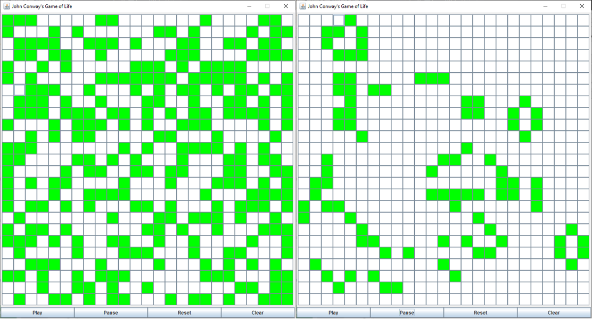

## [John Conway's Game of Life](https://github.com/M-STIG/game-of-life)
Was invented by Mathematician John Conway in 1970 as a zero-player cellular automaton. Normally, it is represented on an infinite grid of square cells that are either alive or dead. Each cell's state is dependent on the state of it's eight neighbors.

This simple example program will represent the patterns found in the Game of Life in a finite two-dimensional array. The cells are often randomly generated like so:
```java
public void randomPond(){
    for (int i=0; i<dimension; i++){
	for (int o=0; o<dimension; o++){
	    currentIntPond[i][o] = num.nextInt(2);
	}
    }
}
```

### Rules
1. Any live cell with fewer than two live neighbours dies, as if by underpopulation.
2. Any live cell with two or three live neighbours lives on to the next generation.
3. Any live cell with more than three live neighbours dies, as if by overpopulation.
4. Any dead cell with exactly three live neighbours becomes a live cell, as if by reproduction.

```java
// Updates each space in the "nextPond" based on local population
// A cell will die if it has less than 2 cells (underpopulation)
// A cell will die if it has more than 3 cells (overpopulation)
if (currentIntPond[i][o] == 1 && (neighbors < 2 || neighbors > 3)){
    nextIntPond[i][o] = 0;
}
// A cell with either 2 or 3 live neighbors will live, unchanged in the next generation
else if (currentIntPond[i][o] == 1 && (neighbors == 2 || neighbors == 3)){
    nextIntPond[i][o] = 1;
}
// A dead  cell will come to life in the next generation if it has exactly three neighbors
else if (currentIntPond[i][o] == 0 && neighbors == 3){
    nextIntPond[i][o] = 1;
}	
```

### Patterns[^1]
Can exist in the Game of Life as stable or repeating structures. Still patterns do not change from generation to generation. Oscillating patterns repeat themselves over potentially many generations without moving to another area. And 'Spaceships' are repeating patterns that travel as generations progress.

|    Still    | Oscillating |  Spaceship  |
| ----------- | ----------- | ----------- |
||||

Interestingly, these patterns will often appear from randomly generated populations.


[^1]:[Images found on Wikipedia](https://en.wikipedia.org/wiki/Conway%27s_Game_of_Life)
